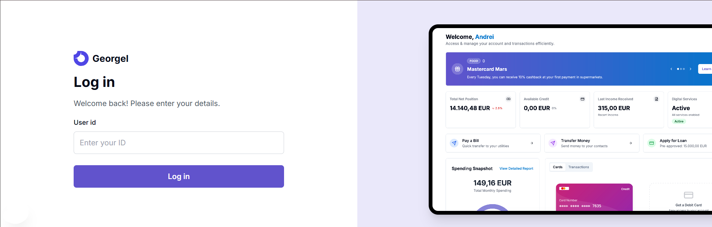

# Georgel - Intelligent banking assistant
Project developed during **[BCR](https://www.linkedin.com/company/bcr/) SegmentNext Hackaton 2025**.

Contributors: [@Bogdan Cătănuș](https://github.com/bogdanmariusc10), [@Tiberiu Gilă](https://github.com/tiberiugila), [@Andrei Vasilică](https://github.com/bourbun), [@Daniel Ghindea](https://github.com/Ghindea)

---

## Overview

**Georgel** is a full-stack web application built in 4 days during the BCR SegmentNext Hackathon. It delivers **personalized banking product recommendations** based on advanced **client segmentation** and behavioral insights. The solution helps financial institutions better understand and serve their customers through intelligent automation.

## Key Features

## Workflow

## Demo

To better understand the solution and its functionality, you can watch a short demo here:  
👉 [View the demo video](https://youtu.be/Us-byGBuJZw?si=u3jNpSO4VRVjV-13)

The video provides a structured walkthrough of the application, showcasing the user flow, segmentation logic, and the recommendation engine in action.
